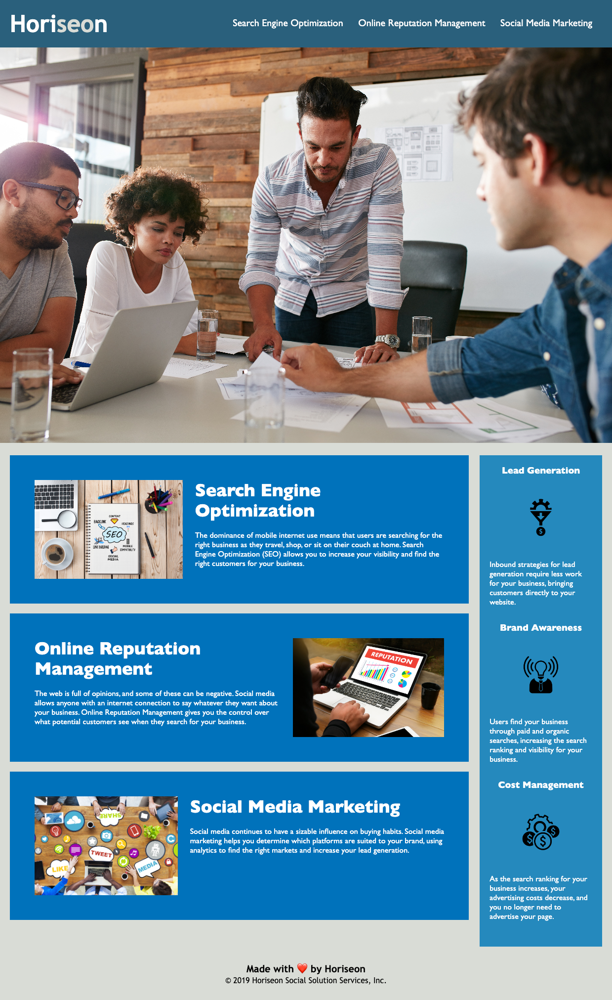

# Challenge Module 1 JessicaOboh

## Horiseon Webpage Update

A marketing agency webpage update which included:

- Adding semantic HTML elements and alt attributes
- Simplifying and reorganizing the existing HTML and CSS files
- The semantic elements and alt attributes should improve the accessibility of the page
- The organizational updates should make future updates simpler and quicker
- I was able to practice using HTML and CSS, and recognize more quickly how changes to them will affect a webpage
- I was able to see the importance of logical layout and organization within HTML and CSS files 

## Usage

The following link can be used to view the webpage: 
https://jessicaob.github.io/Develop-JOchallengemod1/

Here is a screenshot of the completed project: 

## Credits

Thank you to University of Arizona Bootcamp for providing this challenge.

## License

MIT License

